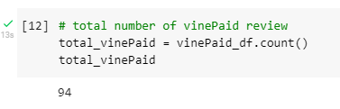
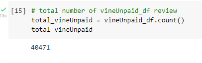
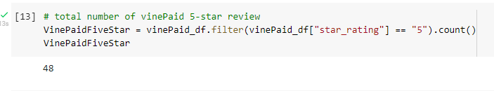
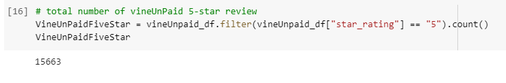

# Amazon_Vine_Analysis

## Overview of the analysis 

The Amazon Vine program is a service that allows manufacturers and publishers to receive reviews for their products. 
Using the dataset, PySpark, Pandas, or SQL to determine if there is any bias toward favorable reviews from Vine members.

## Purpose 

- To perform the FTL process on Amazon Product Reviews; extract the dataset, transform the data, 
    connect to an AWS RDS instance, and load the transformed data into PgAdmin or DBeaver. 
- To determine if there is any bias towards Vine reviews

## Resources 

- Data: Amazon Review datasets; Video Games
- Google Colab Notebook (PySpark), PostgresSQL, pgAdmin 4 / DBeaver and AWS

## Results

- Total number of Vine paid reviews (Vine review)

                                                                        

- Total number of Vine paid reviews (Non-Vine review)

- Total number of Vine paid 5 stars (Vine review 5 stars)

- Total number of Vine Unpaid 5 reviews (Non-Vine review 5 stars)

- Percentage of Vine 5 stars reviews

 

- Percentage of non-Vine 5 stars reviews

## Summary
The analysis shows that there is a positivity bias for reviews in the Vine program because the total percentage of Vine review 5 stars were 51.1% 
whereas non-Vine review 5 stars were 38.7%. Further analysis was performed to access the positivity bias, however averages from helpful votes and total votes for Vine review 5 star were less than non-Vine 5 stars. 